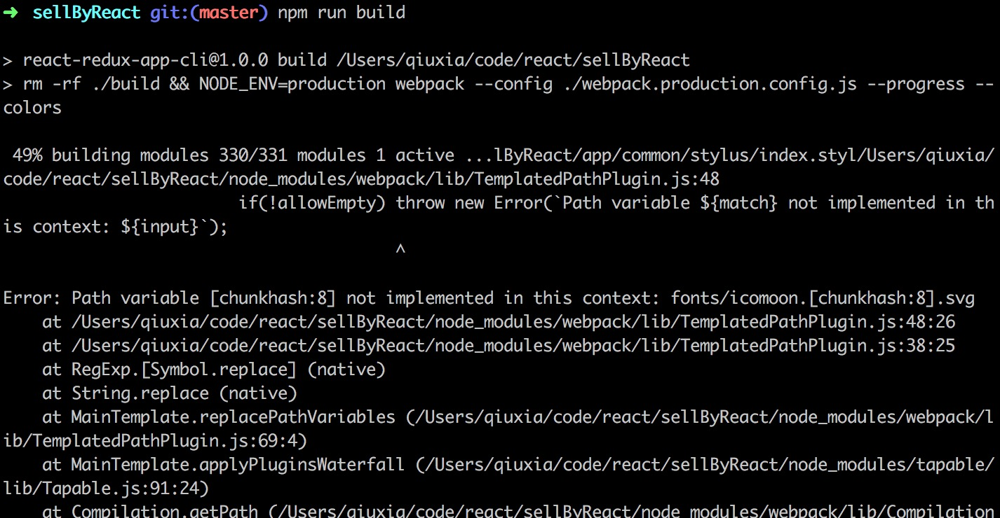

## 项目简介
**脚手架**
根据自己编程和项目组织的习惯，搭建了一个关于react的脚手架。已经发布到npm上了，可以直接使用：https://github.com/Wobugaosuni/react-redux-app-base。

## 遇到的问题和解决方法
- 1. 打包编译时，webpack不能打包svg文件

 

## 待做的事情
- 升级router，使用react-router-dom

