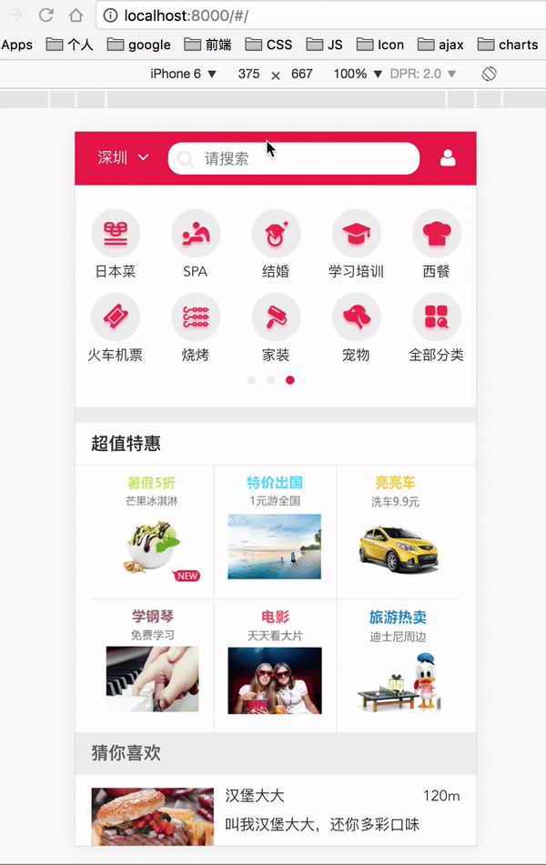

## 项目简介

**脚手架**  <br />
根据自己编程和项目组织的习惯，搭建了一个关于react的脚手架。已经发布到npm上了，可以直接使用：https://github.com/Wobugaosuni/react-redux-app-base
<br />
<br />

**项目展示**  <br />


<br />

## 项目启动

```bash
  # 1. 开启mock数据
  npm run mock

  # 2. 启动
  npm start
```

## 功能简介

**首页**  <br />
- 使用 swipe-js-iso 实现轮播图
- 分页展示商户，监听下拉行为，自动加载更多

**城市页**  <br />
- 使用 redux + localStorage，管理、存储选择的城市

**搜索结果页**  <br />
- 使用 router 对应不同的搜索结果，包括类目搜索、全局搜索

**登录页面**  <br />
- 商户的收藏、购买功能，用户中心页，都要求用户先登录
- 使用 redux 管理用户的登录

**商户详情页**  <br />
- 商户的收藏功能，使用 redux 进行管理
- 用户的评价列表，使用了 自动加载更多

**评价功能**  <br />
- 使用星星评价，并post到后端(mock)

<br />

## 遇到的问题和解决方法

- [升级react-router-dom](./doc/1.升级react-router-dom的一些坑.md)

- [webpack.config.js的publicPath](./doc/2.刷新页面时，js文件404NotFound.md)

- [encodeURIComponent和decodeURIComponent](./doc/encodeURIComponent和decodeURIComponent.md)

- 打包编译时，webpack不能打包svg文件
  <div align=center>
    
  </div>
  解决方法： <br />
  现在浏览器基本也用不到 svg 的字体文件，可以把iconfont里引用svg的相关代码去掉

- 用koa获取到数据了，但接口还是返回 404
源代码：
  ```js
    koaRouter.post('/api/postUserInfo', koaBody, async (ctx, next) => {
      const userInfo = ctx.request.body
      const _userInfo = new db.Login(userInfo)

      _userInfo.save(function(error, data) {
        if (error) {
          // res.status(500).send()
          console.log('save user info error:', error);
          return
        }

        console.log('save data success:', data);
        ctx.body = {
          errorNumber: 1,
          message: 'postUserInfo fail'
        };
      })
    });
  ```
原因是因为 mongonse 查询数据的行为是异步的， 需要在查询数据的代码前加一个 await ， 不然代码走到这里，没有得到异步操作的返回结果，所以默认就返回了404
正确的：
```js
  koaRouter.post('/api/postUserInfo', koaBody, async (ctx, next) => {
    const userInfo = ctx.request.body
    const _userInfo = new db.Login(userInfo)

    await _userInfo.save()
      .then(data => {
        console.log('save data success:', data);
        return ctx.body = {
          errorNumber: 0,
          message: 'postUserInfo success'
        };
      })
      .catch(error => {
        console.log('save user info error:', error);
        return ctx.body = {
          errorNumber: 1,
          message: 'postUserInfo fail'
        };
      })
  });
```


<br />

## 待做的事情

- √ 升级router，使用react-router-dom
- 命令生成模板目录及文件
- 异步组件
