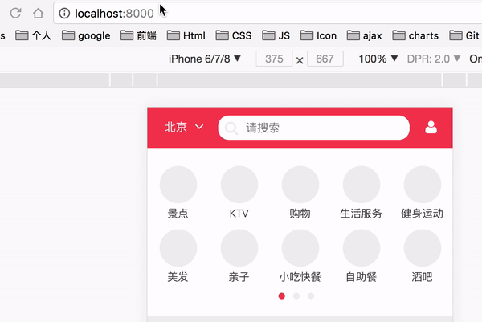

## 升级

按照[react-router-dom](https://reacttraining.com/react-router/web/guides/philosophy)的官方文档，将`react-router`更新到`react-router-dom`，更新了路由的使用方法

需要注意的：
- 使用`BrowserRouter`，不使用`HashRouter`
  关于两者的区别可以看[BrowserRouter](https://reacttraining.com/react-router/web/api/BrowserRouter)，[HashRouter](https://reacttraining.com/react-router/web/api/HashRouter)
  - BrowserRouter使用了HTML5的history的API，可以使用push、replace等的方法更新路由。如：localhost:8080/city
  - HashRouter使用URL的哈希如(window.location.hash)来更新路由。跟BrowserRouter相比，路由地址上多了`/#`，如：localhost:8080/#/city

## 路由跳转后，页面没有重新渲染

如图所示，点击路由，页面没有重新渲染

  

- 在使用一些redux的的`connect()`或者mobx的`inject()`的组件中，如果依赖于路由的更新需要重新渲染，会出现路由更新了但是组件没有重新渲染的情况。这是因为redux和mobx的这些连接方法会修改组件的`shouldComponentUpdate`

- 解决方法是：使用`withRouter`高阶组件解决更新问题，保证withRouter在最外层，比如`withRouter(connect(Component))`

- 可以参考文档：[withRouter](https://reacttraining.com/react-router/web/api/withRouter)
