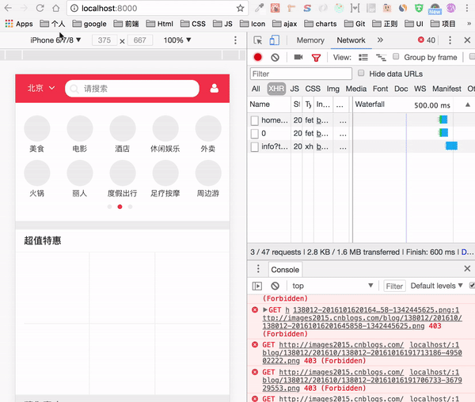
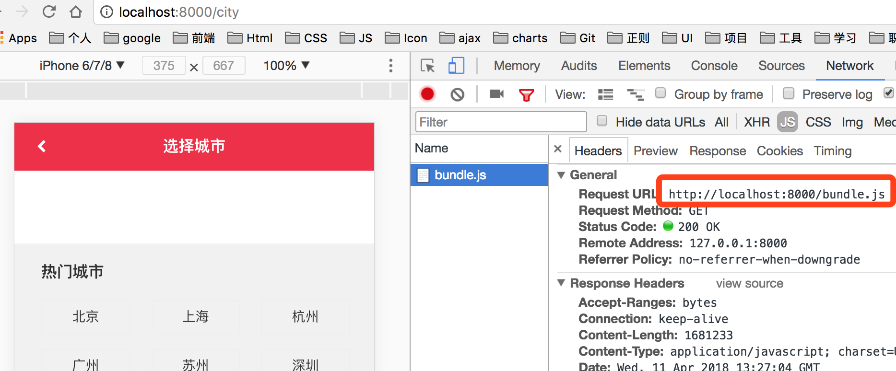
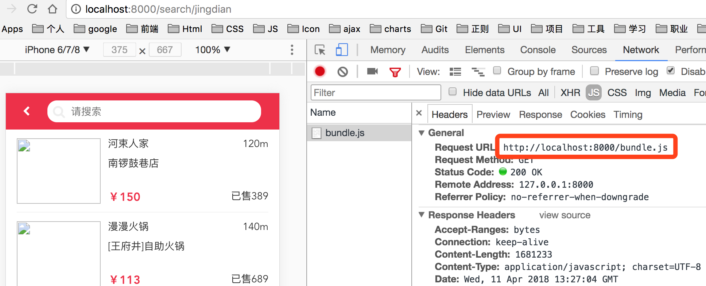
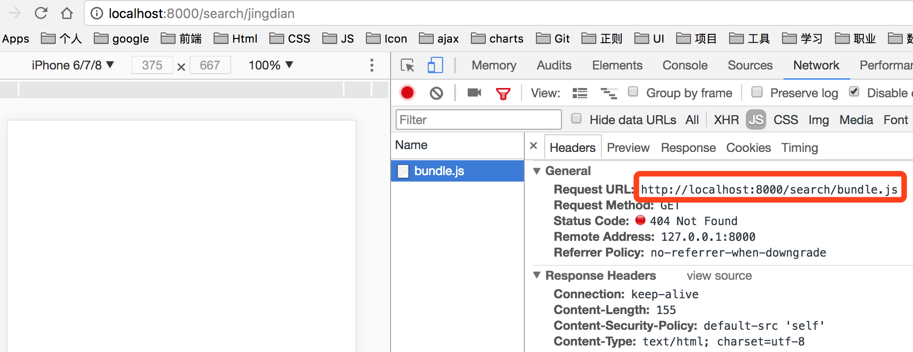

## 刷新页面，js文件404的问题

如动图所示(可以忽略报错，图片加载不出来而已)
<div align=center>
  
</div>

从首页进入城市选择页后，再次刷新页面，没有报错

但是，从首页进入搜索页，再次刷新页面，就报：“http://localhost:8000/search/bundle.js not found"了

一开始百思不得其解，也没有解决的思路……

后来用对比法找到了问题所在

## 对比分析

- 城市页刷新后的bundle.js的路由如下
  <div align=center>
    
  </div>

- 首页进入搜索页后的bundle.js的路由如下
  <div align=center>
    
  </div>

- 刷新搜索页的bundle.js的路由如下
  <div align=center>
    
  </div>

- 很明显地看到，页面可以正常渲染的，bundle.js都是在根目录下的。而报错的js是在相对路径下的。

- 那怎么更改bundle.js的路径呢？

- 我们是在`webpack.config.js`设置出口文件的，即bundle.js。可以看看webpack相关的配置，增加一个`publicPath`的配置
  ```js
    output: {
      filename: 'bundle.js', // 出口文件
      publicPath: '/'  // 绝对路径，不然有些页面刷新时，bundle.js路径会出错
    },
  ```

- 文档参考：[webpack的output配置](https://webpack.js.org/concepts/#output)

## 心得

虽然上面的报错原因和解决方法很清晰简单，但这个问题却困扰了我很久。
问题刚出现的时候，我对比其他人的代码，乱改，没效……
后来google类似问题，才找到解决思路……
所以啊，遇到问题，第一时间要仔细审查代码，进行对比分析
