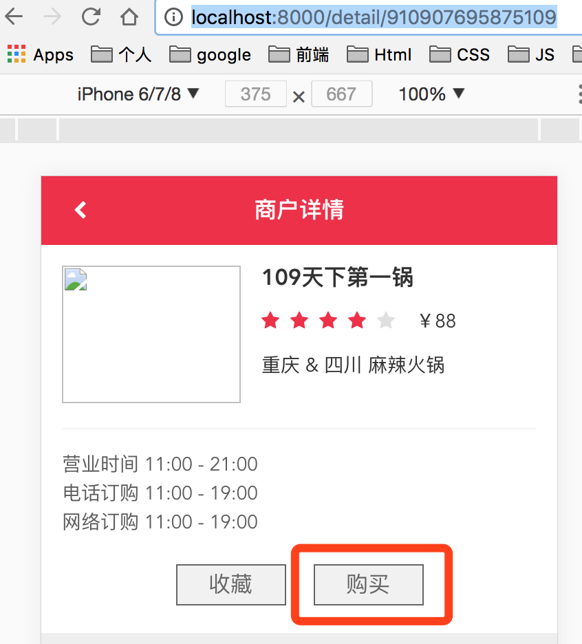
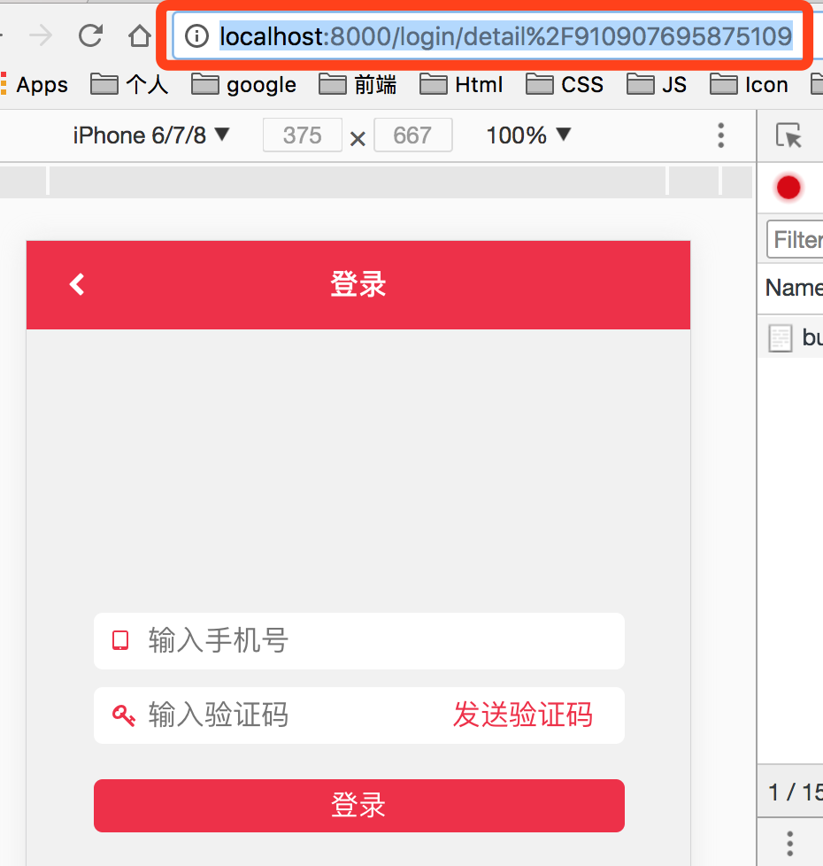

## 路由传参的小技巧

有一个需求，如图。

<div align="center">
  
</div>

在商户详情页里，点击“购买”按钮时，假如没有登录，会先跳到登录页，跳转路由里包含了商户详情页的路由参数`detail/910907..`，目的是登录成功后跳回到详情页

登录页路由设置如下：
```js
  { /* 登录页，及登录后可以跳转的参数路由设置 */ }
  <Route path="/login/:router?" component={Login} />
```

如果直接使用`this.props.match.params.router`取参数，只能拿到“detail”这个字段。

那怎么把`detail/910907..`参数传到登录路由里呢？

可以使用[encodeURIComponent()](https://developer.mozilla.org/zh-CN/docs/Web/JavaScript/Reference/Global_Objects/encodeURIComponent)方法对字符串进行编码处理
```js
  this.props.history.push(`/login/${encodeURIComponent(`detail/${id}`)}`)
```
如下图，路由携带的参数就是经过编码处理的

<div align="center">
  
</div>

登录成功后，使用[decodeURIComponent()](https://developer.mozilla.org/zh-CN/docs/Web/JavaScript/Reference/Global_Objects/decodeURIComponent)方法对字符串进行解码，然后跳回到详情页
```js
  this.props.history.push('/' + decodeURIComponent(params.router));
```

## 总结

路由传参时，如果参数里有几级路由的，例如`detail/xxx/xxx`这个参数，可以先使用`encodeURIComponent()`方法编码。使用时再使用`decodeURIComponent()`方法解码就好了
